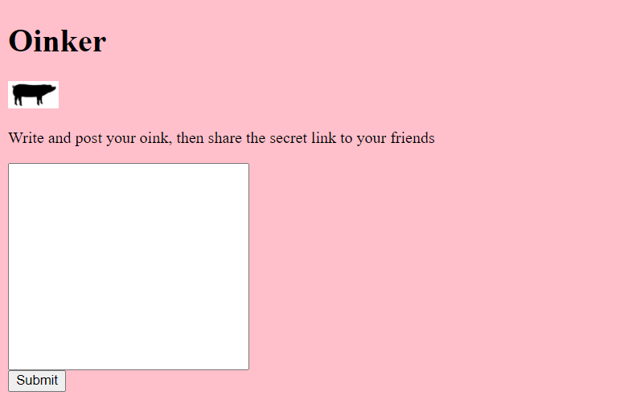

# Oinker
---
I found this cool more private alternative to twitter.

http://web2.utctf.live:5320/

-- a1c3
# Solver
Kita lihat dulu penampakan websitenya

Terdapat form yang mengharuskan kita menginputkan sebuah pesan. Saya coba input ```halo``` ternyata hasilnya ```hoinklo``` setiap huruf ```a``` akan diganti ```oink```. Hmm setelah terjebak beberapa menit saya menyadari pada URL terdapat angka yang menggambarkan id dari pesan kita. yaudah saya coba telusuri ternyata di angka 2 menghasilkan sebuah flag. Bisa dikatakan ini merupakan Bug traversal yang membuat kita bisa melihat pesan orang lain tanpa terotenikasi
#### utflag{traversal_bad_dude}