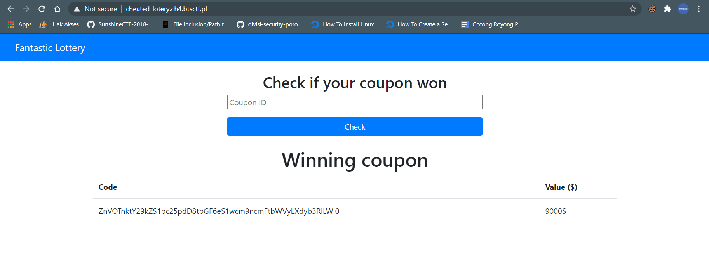

# Cheated lottery
---
I am trying to win this stupid lottery but with no success for a long time...I have to try one more time, I've got new coupon - maybe this is the one? Who knows, maybe I'll win something more than expected?

http://cheated-lotery.ch4.btsctf.pl/

---
# Solver
Ketika kita melihat Page Source nya kita dapat mengirimkan parameter source=1 melalui GET untuk melakukan debug
```

from flask import Flask, render_template, request
from dotenv import load_dotenv
import mysql.connector
import os

load_dotenv()

def get_coupons(form):
    coupons = list()
    mydb = mysql.connector.connect(
        host=os.getenv('mysql_host'),
        user=os.getenv('mysql_user'),
        password=os.getenv('mysql_pwd'),
        database=os.getenv('mysql_db')
    )
    mycursor = mydb.cursor()
    try:
        mycursor.execute("SELECT * FROM coupons WHERE code = '" + str(form['cid']) + "'")
    except:
        pass
    myresult = mycursor.fetchall()
    for x in myresult:
        coupons.append({
            'code': x[1],
            'value': x[2]
        })
    mycursor.close()
    return coupons

app = Flask(__name__)

@app.route('/', methods=['POST', 'GET'])
def index(source=None):
    if request.method == "POST":
        coupons = get_coupons(request.form)
        if coupons == []:
            return render_template('list.html', error="Sorry, you didn't win")
        else:
            return render_template('list.html', coupons=coupons)
    else:
        if request.args.get('source') == '1':
            with open(__file__, 'r') as r:
                return r.read().strip()
        else: 
            return render_template('base.html')

if __name__ == "__main__":
    app.run(host="0.0.0.0", port=7331)

```
Dari situ saya bisa melihat adanya kerentanan SQL Injection. Langsung saya bypas menggunakan payload `' or 1=1 -- ` dan kita akan mendapatkan 

 

`ZnVOTnktY29kZS1pc25pdD8tbGF6eS1wcm9ncmFtbWVyLXdyb3RlLWl0` tinggal decode base64 `fuNNy-code-isnit?-lazy-programmer-wrote-it` 

##### BtS-CTF{fuNNy-code-isnit?-lazy-programmer-wrote-it}