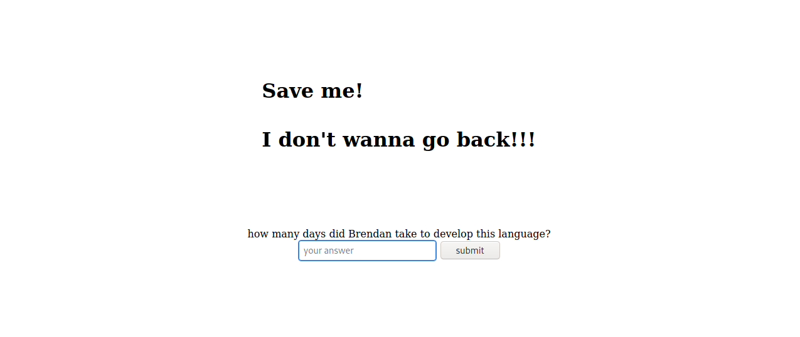
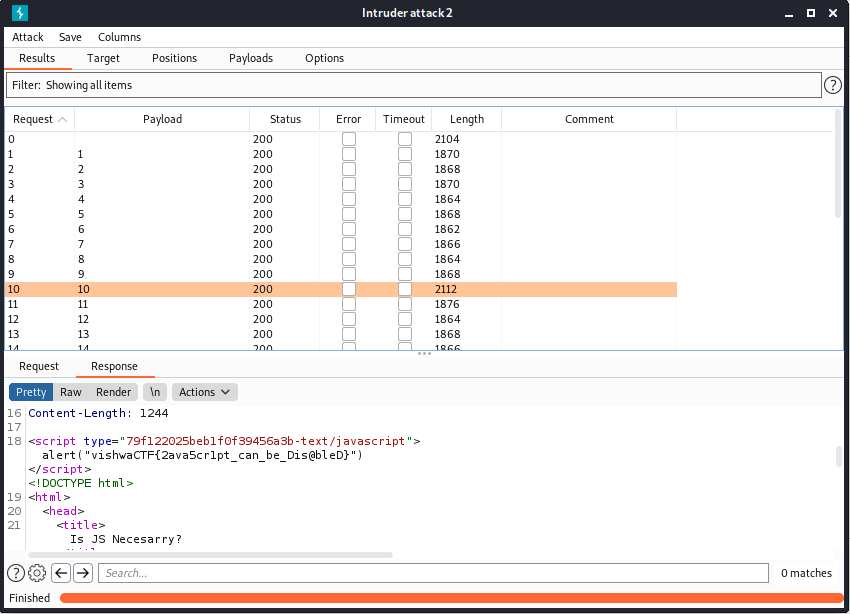

# Is Js Necessary?
---
https://isjsnecessary.vishwactf.com
# Solver
---


Jika kita mengunjungi website tersebut maka akan langsung diarahkan menjuku ke google. Yaudah saya intercept aja menggunakan burpsuite. Sehingga saya tau isi content website tersebut. Ternyata terdapat sebuah form tersembunyi. Form tersebut meminta input parameter ```yourinput``` menggunakan ```POST```. Yaudah saya bruteforce aja pakai intruder punyanya burpsuite nahh tinggal dilihat respone lenght nya yang panjang sendiri mana dan disitulah letak flagnya pada inputan 10


#### vishwaCTF{2ava5cr1pt_can_be_Dis@bleD}