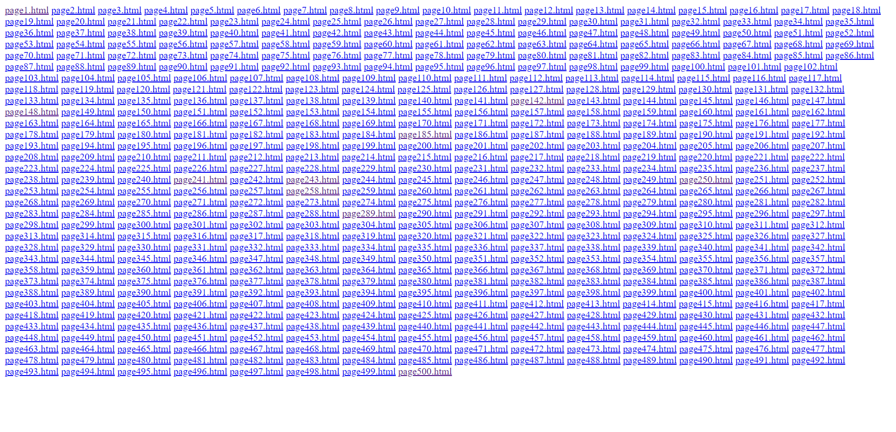

# bot not not bot
---
Ain't Much, But It's Honest Work!!! https://bot-not-not-bot.vishwactf.com/
# Solver
---

Terdapat banyak sekali file html ada 500 an. Pada salah satu halaman terdapat flag. Kalau buka satu satu bakal capek jadinya saya buat script buat nge bruteforce untuk membuka halaman tersebut. Halaman juga sekuensial jadi mudah. Berikut scriptnya
'''
import re
import requests

for i in range(0,501):
	x = requests.get("https://bot-not-not-bot.vishwactf.com/page{}.html".format(str(i)))
	y = re.findall("Useful Page", x.text)
	if y:
		print(x.text)

'''
Tinggal diurutin sesuai pagenya dan dapat flag hehe
#### vishwaCTF{r0bot_15_t00_0P}